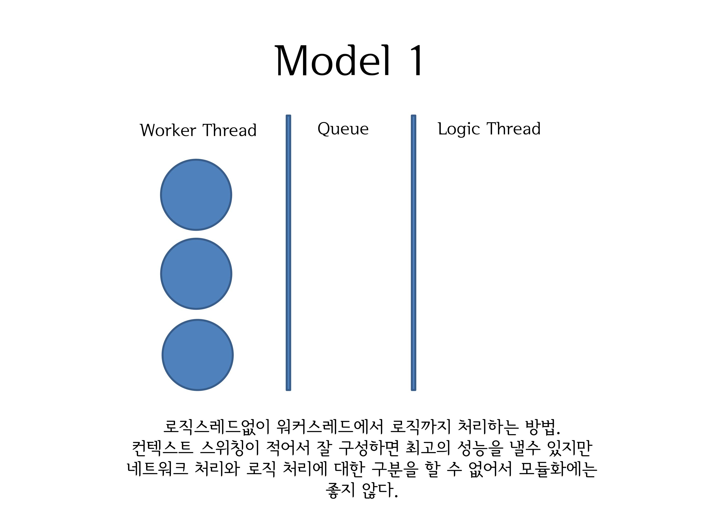
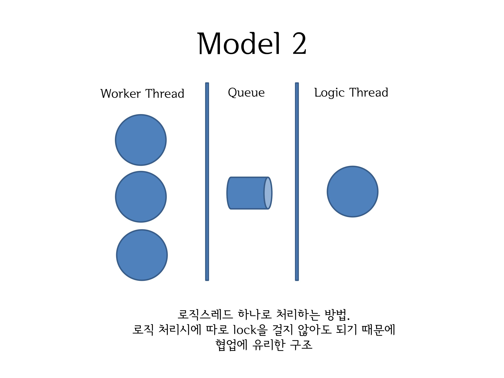
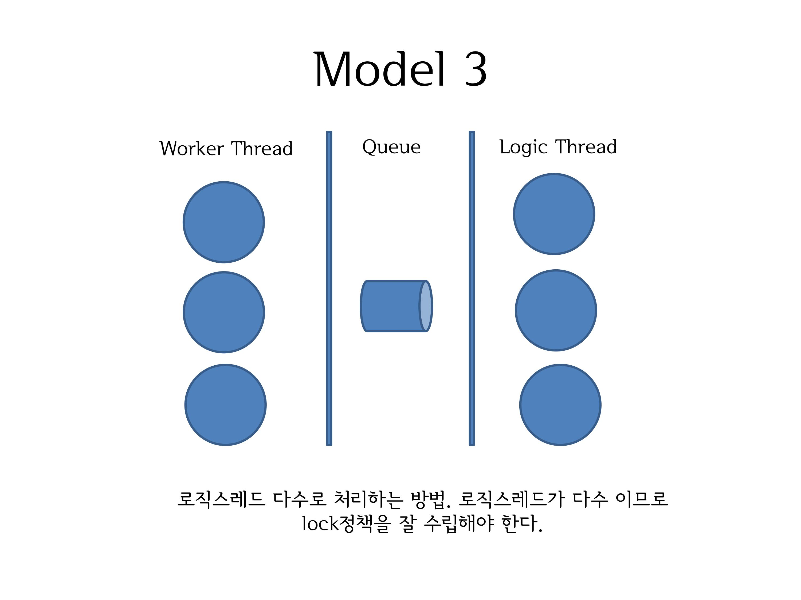
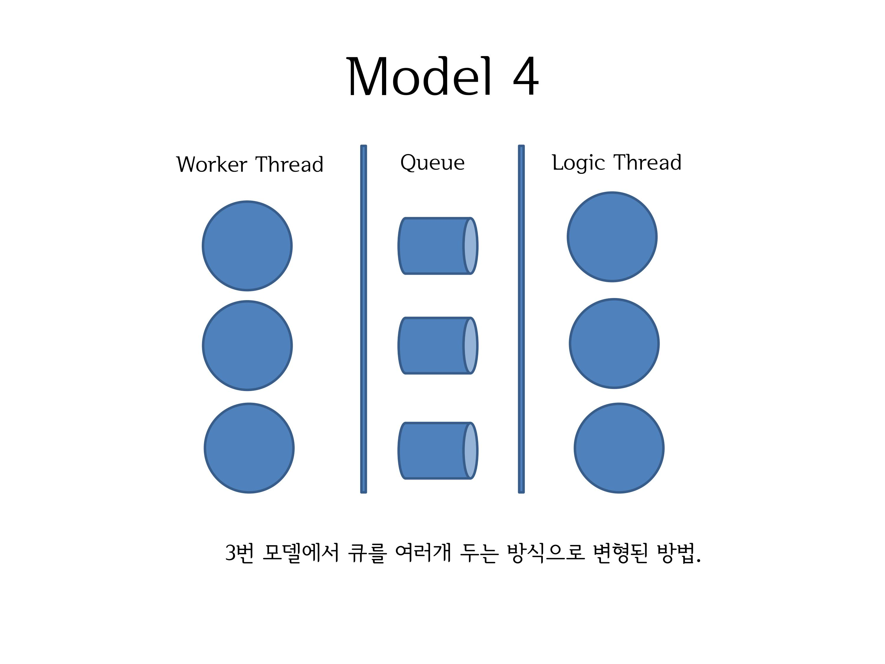

## 🧵 서버 스레드 구조 설계

본 시스템은 MMORPG와 같은 대규모 실시간 게임 서버에서 요구되는 **고성능 처리**와 **모듈화 유연성**을 모두 충족시키기 위해 다음과 같은 스레드 처리 모델을 검토 및 적용하였습니다.

---

### 스레드 분리의 기본 개념

- **Worker Thread**
  - 클라이언트 접속 감지
  - 패킷 수신 및 분배
- **Logic Thread**
  - 수신된 패킷에 대한 게임 로직 처리

서버 설계 방식에 따라:
- Worker가 로직까지 처리할 수도 있고,
- 로직 처리를 전용 스레드에 위임할 수도 있으며,
- 로직 스레드를 다수 구성하거나 큐 구조를 분기할 수도 있습니다.

---

### Model 1 – Worker Thread 단독 처리

- 모든 처리를 Worker Thread가 담당
- **장점**: 컨텍스트 스위칭 없음 → 최고 성능 가능
- **단점**: 로직과 네트워크가 분리되지 않아 **모듈화 불리**

---

### Model 2 – 단일 Logic Thread 처리

- 모든 패킷을 Queue로 전달 → 단일 Logic Thread가 처리
- **장점**: lock 불필요 → **협업/유지보수 용이**
- **단점**: 단일 스레드 병목 가능 → TPS 확장 한계

---

### Model 3 – 다중 Logic Thread 처리

- 하나의 Queue에 여러 Logic Thread가 접근하여 처리
- **장점**: **병렬 처리 가능** → 멀티코어 활용
- **단점**: **lock 정책 필수**, 자원 충돌 가능성 증가

---

### Model 4 – 다중 Queue + 다중 Logic Thread

- Queue 자체를 다수로 구성하고 각 Logic Thread에 분배
- **장점**: lock contention 감소, 처리 효율 향상
- **단점**: 구조 복잡 → Queue 라우팅 정책 필요

---

### 설계 의도 요약

- 구조별 장단점을 실측 및 검토한 결과, 실시간성과 구조적 확장성을 동시에 달성할 수 있는 모델 조합을 선택
- 단순한 이론 적용이 아닌, **데이터 기반 구조 실험 결과**를 반영
- 각 모델은 상황에 따라 적절한 하이브리드 적용이 가능하며, 핵심은 **처리량, 모듈화, 동기화 정책**의 균형에 있음

---

본 서버 구조는 실운영 MMORPG 환경에서 **성능, 유지보수성, 장애 회복성**의 균형을 목표로 설계된 구조입니다. 이후 섹션에서 병렬 처리 최적화(OpenMP, TBB), 실시간 큐 처리 및 IOCP 기반 통합 구조 등을 소개합니다.
