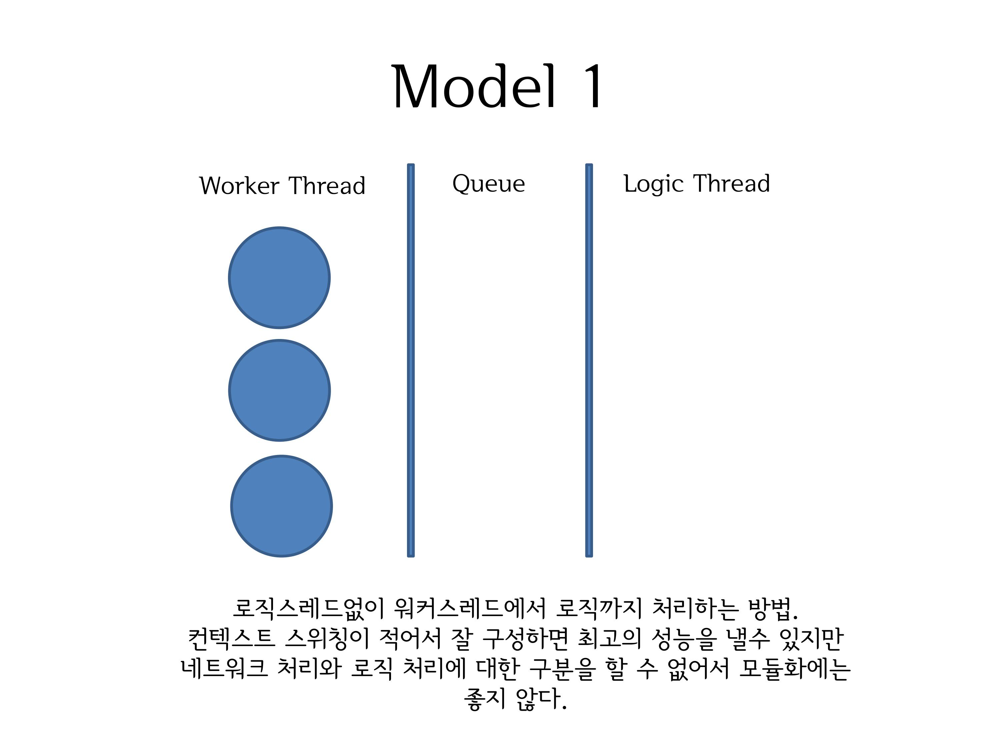
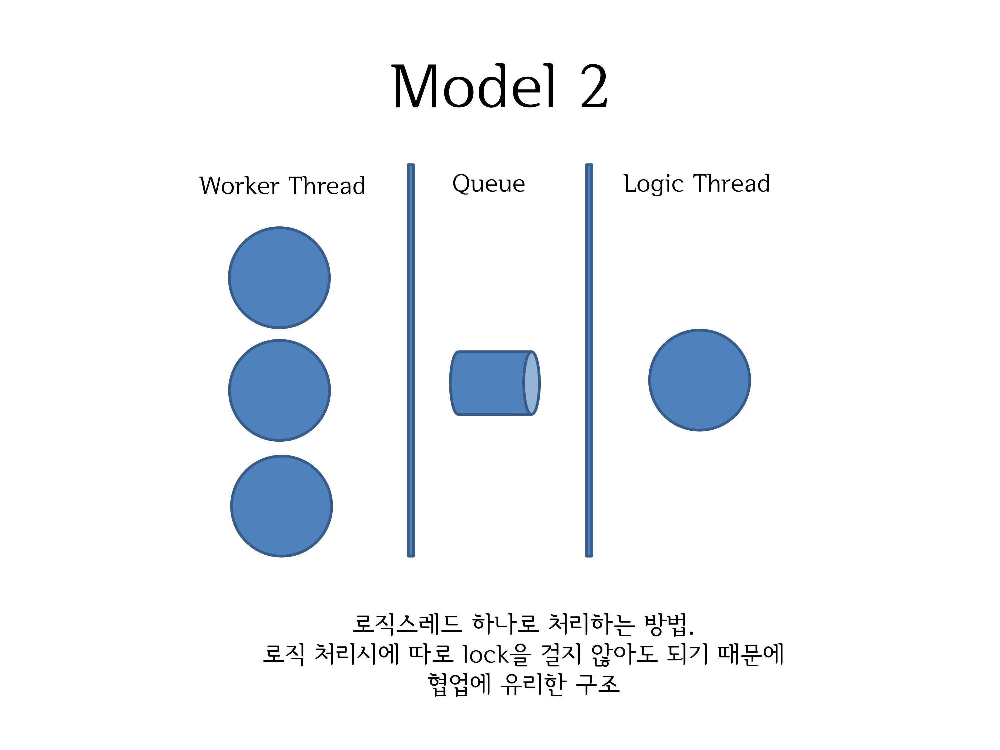
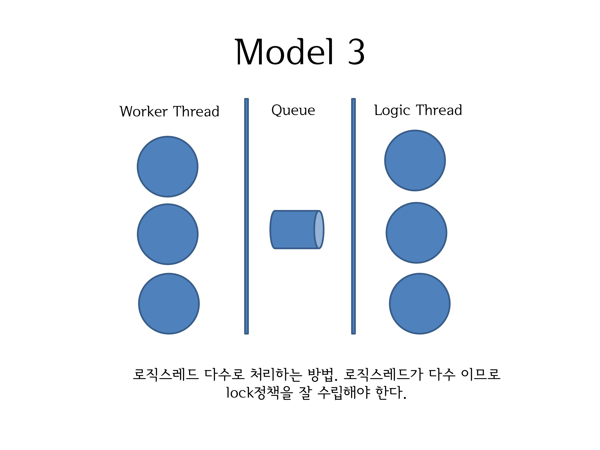
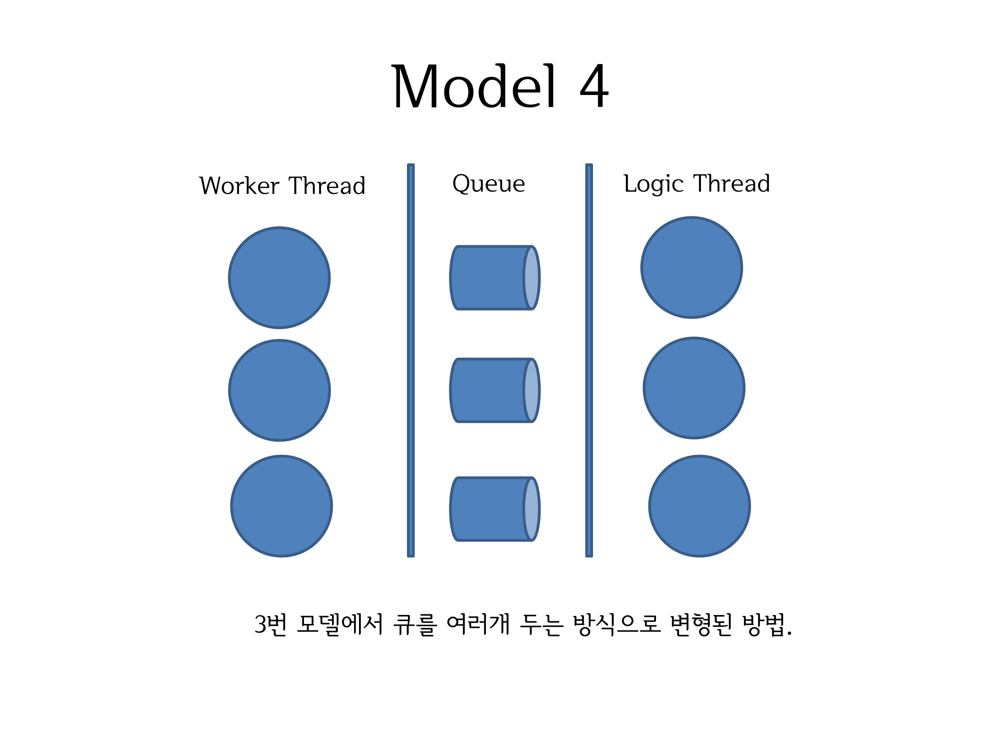

# 🧵 Game Server Thread Models

**대규모 실시간 게임 서버에서 사용할 수 있는 여러 스레드 처리 구조를 비교해보기 위한 프로젝트입니다.**

게임 서버는 클라이언트 요청을 빠르게 처리해야 하고,  
동시에 서버 구조가 너무 복잡해지지 않도록 관리할 수 있어야 합니다.

특히 MMORPG 같은 대규모 실시간 서버에서는  
스레드 구조를 어떻게 가져가느냐에 따라 처리량, 유지보수성, 확장성이 크게 달라집니다.

이 프로젝트에서는 게임 서버에서 사용할 수 있는 대표적인 스레드 처리 모델을 정리하고,  
각 구조가 어떤 장점과 한계를 가지는지 비교했습니다.

특정 모델이 무조건 정답이라고 보기보다는,  
상황에 따라 어떤 구조를 선택하는 것이 좋은지 판단하기 위한 실험 및 정리 목적의 프로젝트입니다.

---

## 📚 목적

이 프로젝트의 목적은 다음과 같습니다.

- 여러 스레드 처리 구조의 장단점 비교
- MMO 서버 환경에서의 성능, 유지보수성, 확장성 검토
- 구조별 병목 지점과 동기화 비용 확인
- 상황에 따른 하이브리드 구조 적용 가능성 검토

---

## 🔧 모델 목록

## 1️⃣ Model 1 - Worker Thread 단독 처리

Model 1은 Worker Thread가 네트워크 처리와 게임 로직 처리를 모두 담당하는 구조입니다.

패킷을 받은 스레드가 바로 로직까지 처리하기 때문에  
추가적인 큐 전달 과정이 적고, 구조가 단순합니다.

성능만 보면 불필요한 context switching이 적어서 빠르게 동작할 수 있습니다.  
하지만 네트워크 처리와 게임 로직이 한 곳에 섞이기 때문에  
코드가 커질수록 유지보수와 테스트가 어려워질 수 있습니다.

### 장점

- 구조가 단순함
- 큐 전달 비용이 적음
- context switching 부담이 적음
- 처리 흐름이 짧아 빠른 응답을 기대할 수 있음

### 단점

- 네트워크 처리와 게임 로직이 강하게 결합됨
- 로직 테스트가 어려워질 수 있음
- 특정 Worker Thread에 부하가 몰릴 수 있음
- 기능이 늘어날수록 코드 관리가 어려워짐

---

## 2️⃣ Model 2 - 단일 Logic Thread 분리

Model 2는 Worker Thread와 Logic Thread를 분리한 구조입니다.

Worker Thread는 패킷을 받은 뒤 바로 처리하지 않고,  
패킷을 Queue에 넣습니다.  
이후 하나의 Logic Thread가 Queue에서 패킷을 꺼내 게임 로직을 처리합니다.

이 구조는 네트워크 처리와 게임 로직이 분리되기 때문에  
코드를 관리하기 쉽고, 로직 테스트도 비교적 편해집니다.

또한 Logic Thread가 하나이기 때문에  
게임 로직 내부에서 복잡한 lock을 많이 사용하지 않아도 된다는 장점이 있습니다.

다만 모든 로직 처리가 하나의 Logic Thread에 모이기 때문에,  
처리량이 늘어나면 병목이 발생할 수 있습니다.

### 장점

- 네트워크 처리와 게임 로직을 분리할 수 있음
- 게임 로직 테스트가 쉬워짐
- 로직 처리 순서를 예측하기 쉬움
- lock 사용을 줄일 수 있음

### 단점

- Logic Thread 하나에 부하가 집중될 수 있음
- 멀티코어 활용이 제한적임
- 처리량이 증가하면 Queue가 밀릴 수 있음
- 대규모 트래픽 처리에는 한계가 있음

---

## 3️⃣ Model 3 - 다중 Logic Thread + Shared Queue

Model 3은 하나의 Shared Queue를 여러 Logic Thread가 함께 소비하는 구조입니다.

Worker Thread는 받은 패킷을 Shared Queue에 넣고,  
여러 Logic Thread가 Queue에서 패킷을 가져가 병렬로 처리합니다.

이 구조는 Model 2보다 멀티코어를 더 잘 활용할 수 있습니다.  
Logic Thread를 여러 개 둘 수 있기 때문에 처리량을 늘리기 쉽습니다.

하지만 여러 스레드가 하나의 Queue에 동시에 접근하기 때문에  
동기화 정책이 반드시 필요합니다.

또한 같은 유저나 같은 객체에 대한 패킷이 서로 다른 Logic Thread에서 처리될 수 있으므로,  
로직 순서 보장과 데이터 충돌 문제를 신경 써야 합니다.

### 장점

- 멀티코어 활용이 가능함
- 단일 Logic Thread 병목을 줄일 수 있음
- Logic Thread 수를 조절해 처리량을 늘릴 수 있음

### 단점

- Shared Queue 접근 시 lock contention이 발생할 수 있음
- 패킷 처리 순서 보장이 어려울 수 있음
- 같은 데이터에 여러 스레드가 접근할 수 있어 동기화가 필요함
- 구조가 Model 2보다 복잡해짐

---

## 4️⃣ Model 4 - 다중 Queue + 다중 Logic Thread

Model 4는 Logic Thread마다 전용 Queue를 두는 구조입니다.

Worker Thread는 패킷을 받은 뒤,  
정해진 라우팅 정책에 따라 특정 Logic Thread의 Queue로 패킷을 전달합니다.

예를 들어 유저 ID, 세션 ID, Zone ID 등을 기준으로  
항상 같은 대상의 패킷이 같은 Logic Thread에서 처리되도록 만들 수 있습니다.

이 구조는 Shared Queue에서 발생하는 lock contention을 줄일 수 있고,  
데이터 소유권을 명확히 나누면 동기화 비용도 줄일 수 있습니다.

대신 어느 Queue로 패킷을 보낼지 결정하는 라우팅 정책이 필요하고,  
부하가 한쪽 Queue에 몰리지 않도록 관리해야 합니다.

### 장점

- Queue 충돌을 줄일 수 있음
- Logic Thread별로 처리 대상을 분리할 수 있음
- 멀티코어 확장성이 좋음
- 데이터 소유권을 잘 나누면 lock 사용을 줄일 수 있음

### 단점

- 구조가 복잡함
- Queue 라우팅 정책이 필요함
- 특정 Queue에 부하가 몰릴 수 있음
- Thread 간 작업 이동이 필요한 경우 설계가 어려워질 수 있음

---

## 🧠 비교 관점

각 모델은 다음 기준으로 비교했습니다.

| 비교 항목 | 설명 |
|---|---|
| 처리량 | 많은 패킷을 얼마나 빠르게 처리할 수 있는지 |
| 구조 단순성 | 구현과 이해가 쉬운지 |
| 유지보수성 | 기능 추가, 수정, 테스트가 쉬운지 |
| 동기화 비용 | lock, Queue 충돌, 데이터 경쟁이 얼마나 발생하는지 |
| 확장성 | Thread 수나 서버 구조를 늘렸을 때 대응이 쉬운지 |
| 장애 대응 | 특정 Thread나 Queue에 문제가 생겼을 때 격리와 복구가 가능한지 |

---

## 🔍 핵심 정리

각 모델은 장단점이 분명합니다.

Model 1은 구조가 단순하고 빠를 수 있지만,  
네트워크와 로직이 섞이기 때문에 규모가 커질수록 관리가 어려워질 수 있습니다.

Model 2는 로직을 분리하기 좋아서 유지보수에는 유리하지만,  
단일 Logic Thread가 병목이 될 수 있습니다.

Model 3은 여러 Logic Thread를 사용해 처리량을 늘릴 수 있지만,  
Shared Queue와 데이터 동기화 문제가 중요해집니다.

Model 4는 확장성 면에서 가장 유리하지만,  
Queue 분배 정책과 부하 분산 설계가 필요합니다.

실제 MMO 서버에서는 하나의 구조만 고정해서 쓰기보다는,  
패킷의 성격이나 처리 대상에 따라 여러 모델을 섞어 사용하는 방식이 현실적입니다.

예를 들어 다음과 같은 구성이 가능합니다.

| 처리 대상 | 적합한 구조 예시 |
|---|---|
| 로그인, 인증, 간단한 요청 | Model 2 |
| 유저별 독립 처리 | Model 4 |
| 단순 병렬 작업 | Model 3 |
| 빠른 내부 처리용 경량 모듈 | Model 1 |

---

## 🛠️ 이후 검토할 내용

앞으로는 단순 구조 비교를 넘어서,  
실제 게임 서버에 가까운 형태로 테스트를 확장할 예정입니다.

- IOCP 기반 네트워크 구조와 각 모델의 연결 방식
- Lock-free Queue 적용 테스트
- Cache alignment를 통한 false sharing 감소
- Thread별 부하 측정
- Queue backlog 모니터링
- OpenMP, TBB 같은 병렬 처리 라이브러리 적용 가능성 검토
- 패킷 유형별 하이브리드 처리 구조 실험

---

## 📌 참고

이 프로젝트는 게임 서버의 스레드 처리 구조를 정리하고 비교하기 위한 자료입니다.

단순히 이론적인 설명만 정리하는 것이 아니라,  
실제 MMO 서버에서 어떤 방식으로 구조를 가져갈 수 있을지 고민하는 데 초점을 두었습니다.

구조별 실측 성능 비교와 샘플 코드는 이후 추가할 예정입니다.

---

## 📬 Contact

피드백이나 논의는 [Issues](https://github.com/beckhamRealMadrid/GameServerThreadModels/issues)를 통해 남겨주세요.
